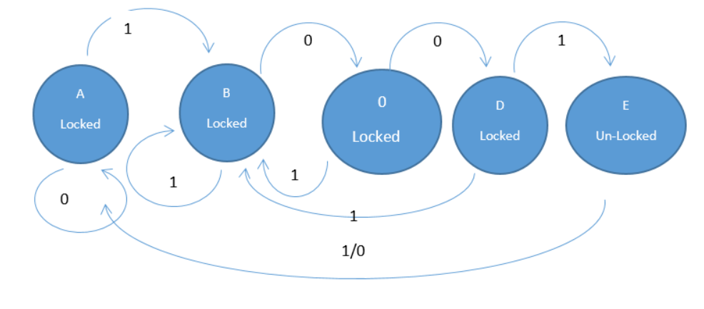
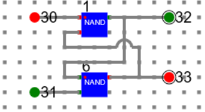
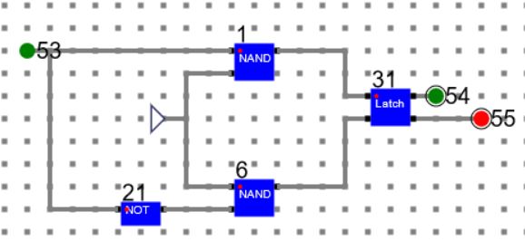
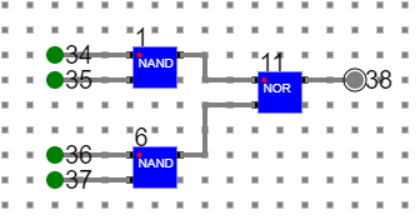
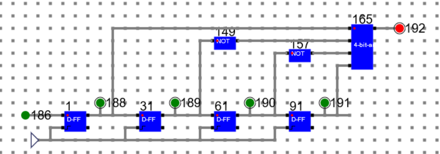
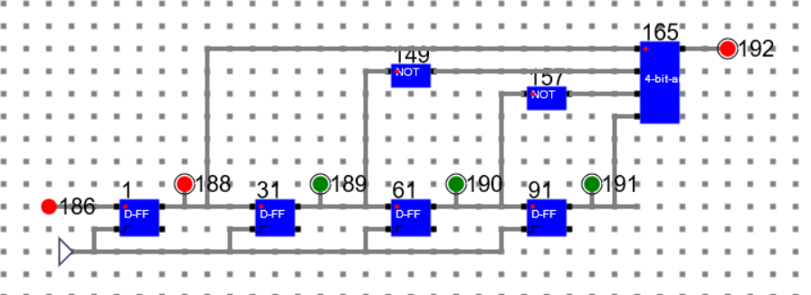
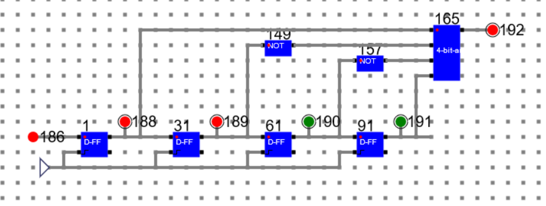
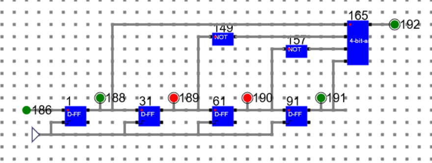
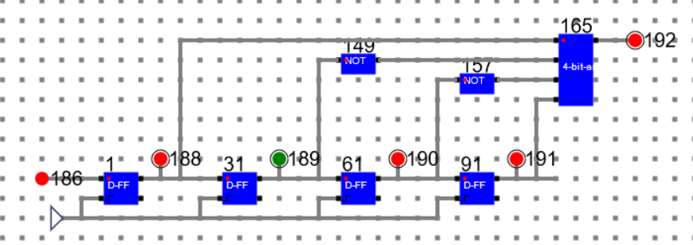

# Procedure

## Finite State Machine

Here we have design a finite state machine for a simple combinational lock where the passcode is 4 bit binary number 1001. To design a state machine for a 4-bit combinational lock with the passcode 1001, we can create a sequential circuit that tracks the input sequence one bit at a time. This can be implemented as a Moore machine, where the output depends only on the current state. The machine will have a series of states corresponding to the correct sequence fragments detected so far.  The state diagram is as follows.

    

## State diagram

### State machine design specifications
- **Inputs:** A single binary input, X, where each bit of the passcode is entered sequentially. A Reset signal is also included to return the system to its initial state at any time.
- **Outputs:** A single binary output, Unlock, which becomes 1 only when the full, correct sequence 1001 has been entered.
- **States:** The machine requires one state for each bit of the passcode plus an initial reset state. We will define five states:
- **State A (Reset):** The initial state. The system is waiting for the first correct bit of the passcode. The Unlock output is 0.
- **State B (Got '1'):** The first bit, a 1, has been correctly entered.
- **State C (Got '10'):** The first two bits, 10, have been correctly entered.
- **State D (Got '100'):** The first three bits, 100, have been correctly entered.
- **State E (Unlocked):** The full sequence 1001 has been entered. The Unlock output is 1

Here is the State Transition Table for above combinational lock.

<b>

|Present State|Input (X)|Next State|Output (Unlock)|
|:---:|:---:|:---:|:---:|
|A|0|A|0|
|A|1|B|0|
|B|0|C|0|
|B|1|B|0|
|C|0|D|0|
|C|1|B|0|
|D|0|A|0|
|D|1|E|0|
|E|0|A|1|
|E|1|B|1|
|All states|Reset = 1|A|0|

</b>

### Explanation of state transitions
- **From State A (Reset):** The lock is waiting for the first bit.
    - **Input X=1:** The first correct bit is received. Transition to State B.
    - **Input X=0:** An incorrect bit is received. Remain in State A.
- **From State B (Got '1'):** The first 1 is received.
    - **Input X=0:** The second correct bit is received. Transition to State B.
    - **Input X=1:** An incorrect bit is received. However, this 1 could be the start of a new sequence. Stay in State B, as the new potential sequence (1) is now correctly in place. This is an overlapping sequence detection feature.

- **From State C (Got '10'):** The sequence 10 is received.
    - **Input X=0:** The third correct bit is received. Transition to State D.
    - **Input X=1:** An incorrect bit is received. However, this 1 could be the start of a new sequence. Go back to State B.

- **From State D (Got '100'):** The sequence 100 is received.
    - **Input X=1:** The fourth and final correct bit is received. The lock is opened. Transition to State E.
    - **Input X=0:** An incorrect bit is received. The sequence is broken. Reset to State A.

- **From State E (Unlocked):** The lock is open.
    - **Input Reset=1 or X=0:** Any subsequent input or an explicit Reset signal will re-lock the machine. Return to State A.
    - **Input X=1:** This input could be the start of a new sequence (1). Go back to State B. This allows for re-locking with a specific input while still handling overlapping patterns if the user were to try a different sequence. 

## Simulation

Simulation of the above combination lock has been shown below with the help of D Flip Flop and 4 bit AND gate.

- The D Flip Flop is designed as below:
    - Design Latch circuit and make a component say ‘Latch’.

    

    

    

    - Using the latch, design a D-FF and make a component as shown below.

    

    

    

- 4 input AND gate is designed as below.

 

## Circuit and Simulation of the combinational lock is as below

***186: Input, 192: Output***

### State 1: Data: 1111 State: Locked

    

### State 2: Data: 0111 State: Locked

### State 3: Data: 0011 State: Locked

### State 4: Data: 1001 State: Un-Locked

### Step 5: Data: 0100 State: Locked

# Manual
- Refer the simulator manual on how to design the circuit
    - Manual --> [Click Here](./simulation/coavlNew.pdf)

<embed src="./simulation/coavlNew.pdf" type="application/pdf">

