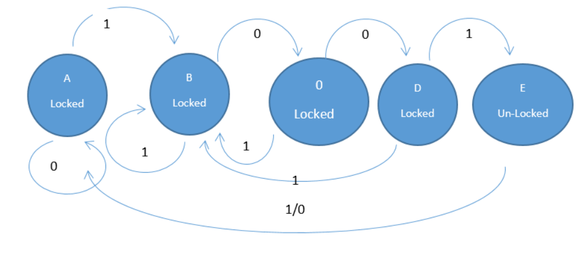
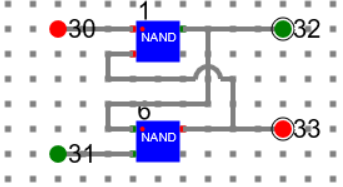
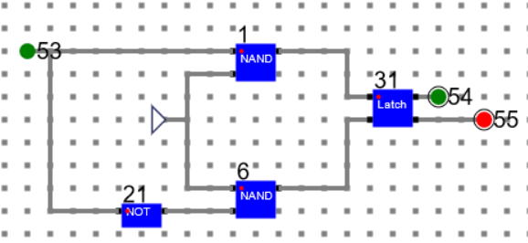
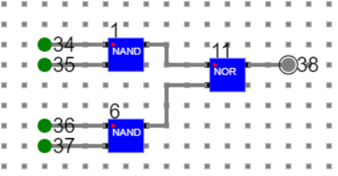
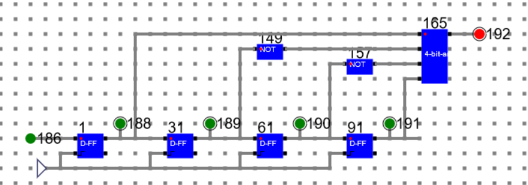
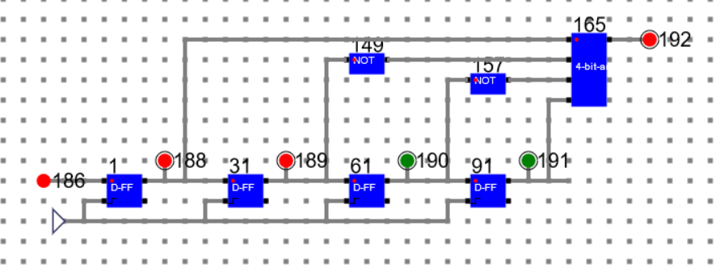
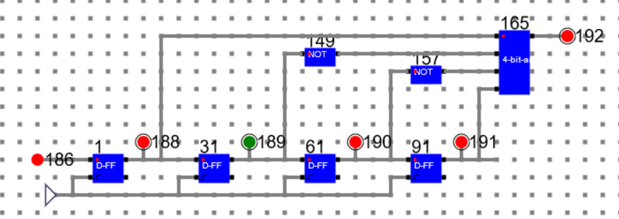

# Procedure

## Circuit Diagram and Simulation of a Finite State Machine
Here we have design a state machine for a simple combinational lock where the passcode is 4 bit binary number 1001. The state diagram is as follows.

    

The corresponding circuit diagram and simulation has been shown below with the help of D Flip Flop and 4 bit AND gate.

- The D Flip Flop is designed as below:
    - Design Latch circuit and make a component say ‘Latch’.
    

    

    

    - Using the latch, design a D-FF and make a component as shown below.
    

    

    

- 4 input AND gate is designed as below.

 

## Circuit and Simulation of the combinational lock is as below

***186: Input, 192: Output***

### State 1: Data: 1111 State: Locked

    

### State 2: Data: 0111 State: Locked

### State 3: Data: 0011 State: Locked

### State 4: Data: 1001 State: Un-Locked

### Step 5: Data: 0100 State: Locked

# Manual
- Refer the simulator manual on how to design the circuit
    - Manual --> [Click Here](./simulation/coavlNew.pdf)

<embed src="./simulation/coavlNew.pdf" type="application/pdf">

