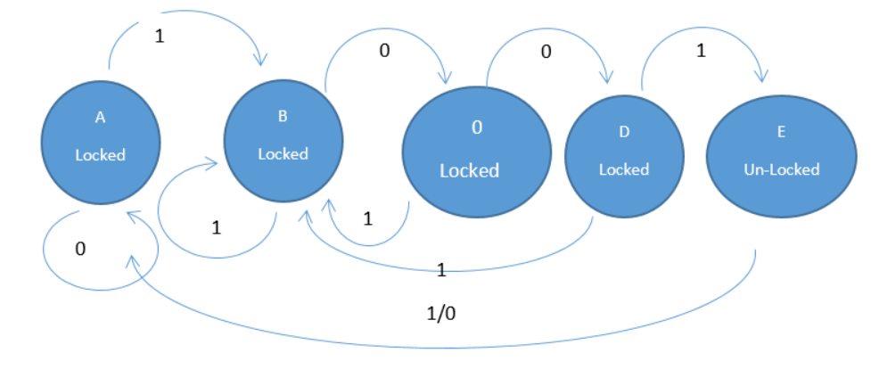
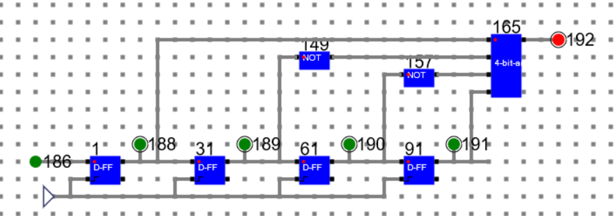
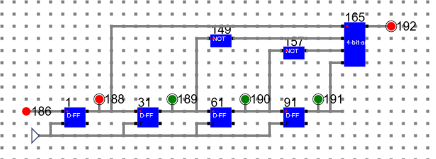
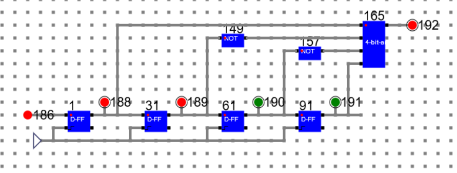
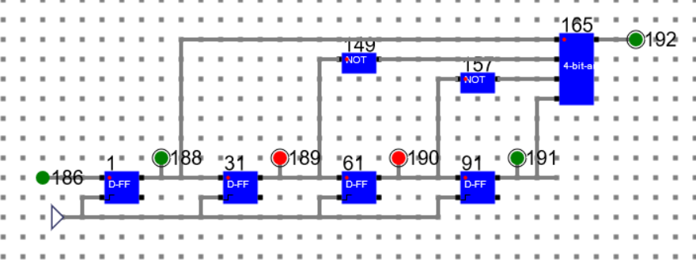
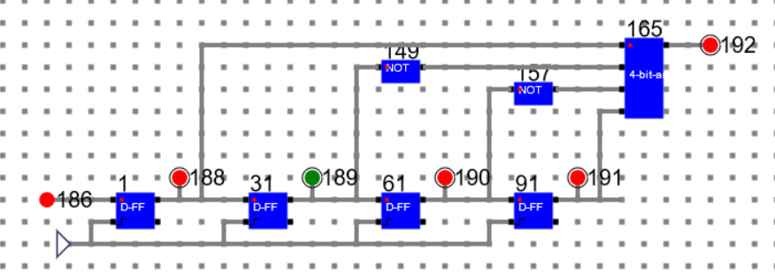

# Theory:

A ***finite state machine*** (sometimes called a finite state automaton) is a computation model that can be implemented with hardware or software and can be used to simulate sequential logic and some computer programs. Finite state automata generate regular languages. Finite state machines can be used to model problems in many fields including mathematics, artificial intelligence, games, and linguistics.

## Example:

    

##### 3-IN-NAND (27, 28, 29: inputs. 30: Output)  		

A system where particular inputs cause particular changes in state can be represented using finite state machines. This example describes the various states of a turnstile. Inserting a coin into a turnstile will unlock it, and after the turnstile has been pushed, it locks again. Inserting a coin into an unlocked turnstile, or pushing against a locked turnstile will not change its state.
Here we’ll experiment with synchronous finite state machine with the help of the simulator.

## Circuit Diagram and Simulation of a Finite State Machine
Here we have design a state machine for a simple combinational lock where the passcode is 4 bit binary number 1001. The state diagram is as follows.

    

The corresponding circuit diagram and simulation has been shown below.

***186: Input, 192: Output***

### State 1: Data: 1111 State: Locked

    

### State 2: Data: 0111 State: Locked

### State 3: Data: 0011 State: Locked

### State 4: Data: 1001 State: Un-Locked

### Step 5: Data: 0100 State: Locked

