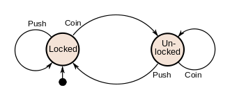

# Theory:

A finite state machine (FSM) is a computational model with a finite number of states that transitions between them based on inputs. Moore and Mealy machines are two types of FSMs that produce output, but their outputs are generated differently. In a Moore machine, the output depends solely on the current state, while in a Mealy machine, the output depends on both the current state and the current input.  

## Moore machine
- **Output:** Determined only by the current state. 
- **Output behaviour:** The output changes only when the machine transitions to a new state. 
- **State diagram:** Each state is associated with a specific output. 

## Mealy machine
- **Output:** Determined by both the current state and the current input.
- **Output behaviour:** The output can change whenever an input changes, even if the machine stays in the same state.
- **State diagram:** Outputs are associated with the transitions between states, not the states themselves

## Example:

This example describes the various states of a turnstile. Inserting a coin into a turnstile will unlock it, and after the turnstile has been pushed, it locks again. Inserting a coin into an unlocked turnstile, or pushing against a locked turnstile will not change its state.

##### Figure 1: Turnstile

